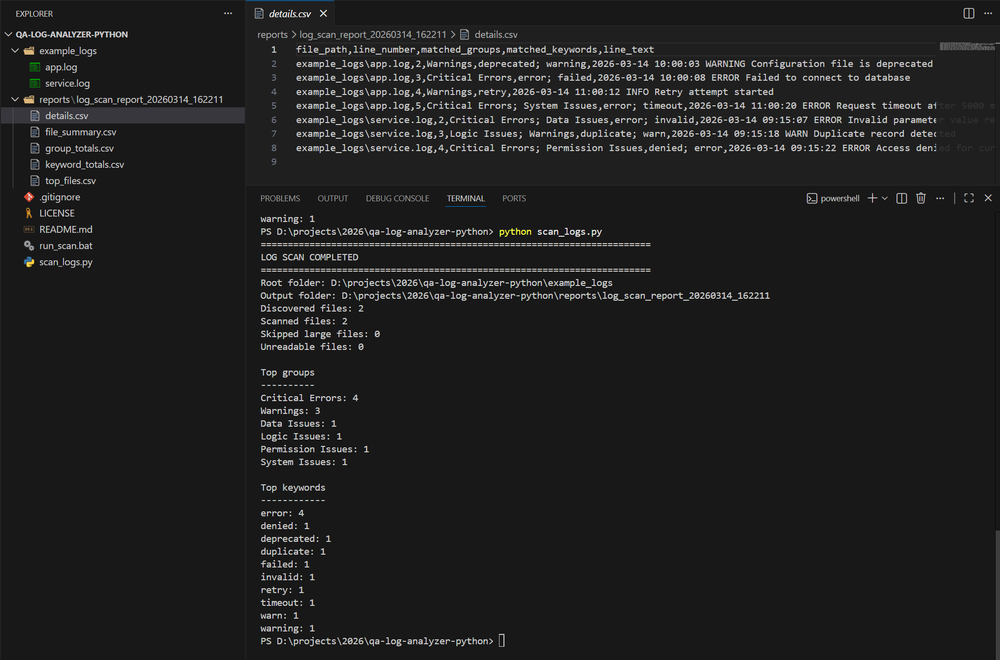

# QA Log Analyzer (Python)

This is a small Python tool that scans log files and looks for common indicators of problems, such as:

- error
- warning
- timeout
- invalid
- exception

The script analyzes log files and generates CSV reports that make it easier to review large logs and quickly identify potential issues.

I originally created this tool to make log analysis faster during testing and troubleshooting.

---

## What the tool does

The script scans log files and:

- searches for common error-related keywords
- groups matches by category
- counts occurrences
- generates CSV reports

The reports help quickly answer questions like:

- Which files contain the most errors?
- What type of problems appear most often?
- Which log lines should be investigated first?

---

## Project structure

```text
qa-log-analyzer-python
│
├─ scan_logs.py
├─ run_scan.bat
├─ README.md
├─ LICENSE
├─ .gitignore
│
├─ example_logs
│   ├─ app.log
│   └─ service.log
│
└─ reports
```

---

## How to run

### Option 1 — Python
python scan_logs.py

### Option 2 — Windows

Double-click:
run_scan.bat

Reports will be generated in the `reports` folder.

---

## Example log lines detected
[ERROR] Failed to connect to service
Request timeout after 5000 ms
Invalid configuration parameter
Access denied for current user
Duplicate record detected

## Example Output


---

## Requirements

- Python 3.9+
- No external libraries required

---

## Why I built this

When working with large logs, it is easy to miss important messages.  
This script helps highlight potential problems automatically and provides a quick overview of what is happening in the logs.

---

## License

MIT
